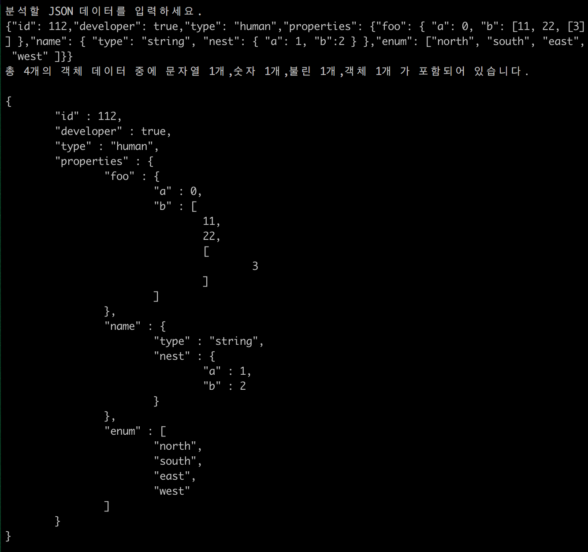
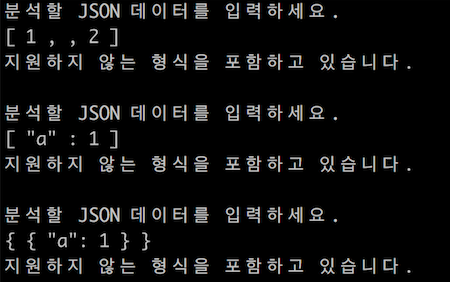
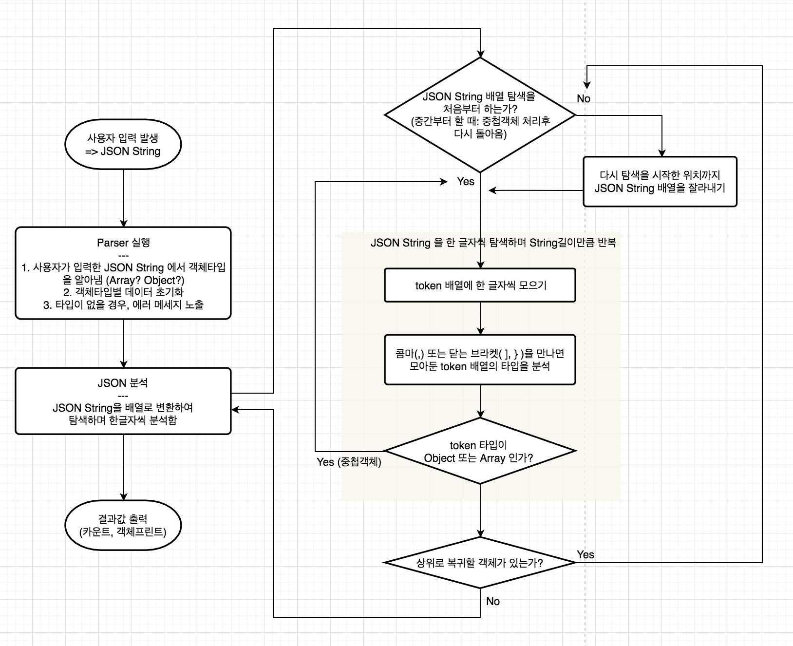
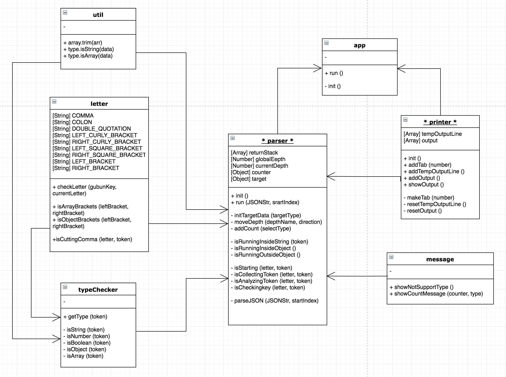

# JSON 문자열 생성기
문자열 형태의 JSON 데이터를 받아서, (뎁스1 기준) 데이터 타입별로 갯수를 집계 + 정렬된 객체형태로 출력해주는 프로그램입니다.

 

**[ 입출력 실행 화면 ]**

JSON 데이터 규격에 맞는 입력값이 들어왔을 경우, 결과값을 보여줍니다. 

JSON 데이터 규격에 맞지 않을 경우, 에러메시지를 보여줍니다. 

  

## 가능한 기능들
* 커맨드라인에서 입출력 제공
* JSON 데이터 규격에 맞지 않는 케이스 체크
* 데이터 종류별 카운팅 : JSON의 1뎁스 기준으로 데이터타입별로 갯수 집계  
(지원하는 데이터 타입: String, Number, true/false, Object, Array)
* 중첩된 객체의 분석 가능 (Object, Array)
* Pretty Print : 입력받은 JSON String을 정렬된 모양으로 출력해 줌

  

## 구현한 Parser의 JSON String 분석 절차 및 설계

 

**[ Parser의 JSON String 분석 절차 ]**

입력받은 JSON String을 한글자씩 돌면서 아래 4가지 상태를 기준으로 검사하여 처리합니다.

* ⓐ **시작 (parser._isStarting)** : JSON String 시작
* ⓑ **모음 (parser._isCollectingToken)** : token 배열에 한 글자씩 모으기
* ⓒ **멈춤/값분석 (parser._isAnalyzingToken)** : 콤마(,) 또는 닫는 브라켓 ( ], } )을 만나면, 모아둔 token 배열의 타입을 분석
* ⓓ **멈춤/key분석 (parser._isCheckingKey)** : 콜론(:)을 만나면, 모아둔 token 배열이 string타입인지 분석한 뒤 token을 비움

 

배열일 경우 

오브젝트일 경우 

 

**[ 중첩구조 처리 방법 ]**

중첩구조를 만나면 스택을 이용하여 정보를 저장합니다. (코드 내의 returnStack)

**(예)  [ 1, [ 2, [ 3 ], 4 ] 이라는 3개의 배열이 중첩된 데이터**

Depth1 기준으로 문자 하나씩 탐색해 나갑니다. 

두번째 값인 [2,[3]]의 type이 array이므로 Return Stack에 { JSONStr: “ 현재 JSON 스트링값” , startIndex: “array를 만나 멈춘 인덱스 위치” } 를 저장한 뒤,  
반복문을 멈추고 밖으로 나가서 

Depth2 기준으로  
두번째 값인 array를 기준으로 다시 탐색을 시작합니다.  
또 [3]이라는 array를 만났으므로 Stack에 정보를 저장하고, 반복문을 멈춘 뒤 

Depth3 기준으로 다시 탐색을 시작합니다.  
이번에는 멈추지않고 모두 통과했으므로 Return Stack에 값이 있는지 체크합니다.  
있으면 [return stack].pop() 하여 마지막으로 들어온 데이터를 뽑아와 

 
Depth2 기준으로 returnStack.JSONStr 을 returnStack.startIndex부터 다시 탐색시작합니다.  
이번에도 모두 통과했으므로 마지막 Return Stack 데이터를 뽑아와 

남은 문자열을 탐색합니다. 

이 과정들을 플로우차트로 그려보면 다음과 같습니다. 

 

**[ 설계 ]**

객체 구성과 참조하는 모습을 아래 플로우차트로 표현했습니다. 

* util : 유틸리티 모음
* letter : 문자열 한 개 단위를 letter라 정의하고, 문자의 이름을 체크하는 역할
* typeChecker : parser에서 모은 token배열을 가져와 타입을 검사하여 알려줌
* parser : 사용자가 입력한 JSON String을 가져와 분석
* printer : parser가 JSON 을 탑색하는 동안 정렬된 모양으로 프린팅할 String들을 저장하는 역할
* message : 출력메시지 관련 기능
* app : 앱을 초기화하고 구동시킴

  

## 앞으로 구현해보고 싶은 기능
* 현재는 JSON String 돌면서 print기준으로 String조각을 잘라 넣는데,
	* 변경하고 싶은 방향은 JSON String 돌면서 실제 오브젝트 객체로 만든 뒤, 마지막에 실제로 변환된 객체를 print 해주기
* Browser에서 입력을 받고 객체 트리를 만들어 보여주기
* 테스트 코드 작성

